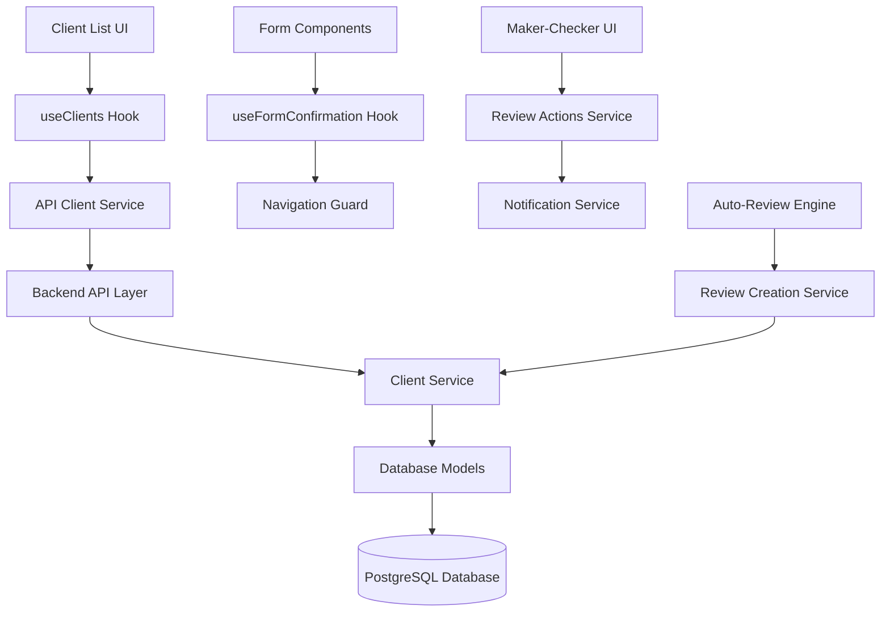
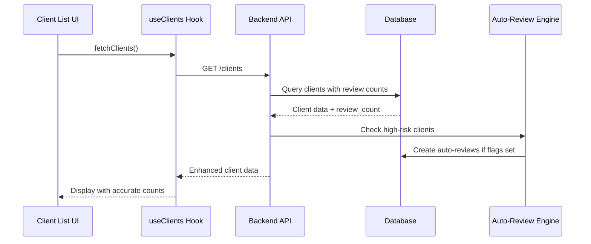

# Client List Display Fixes - Design Document

## Overview

This design addresses multiple enhancements to the client management system:
1. Fixing inaccurate review count displays and missing color coding
2. Adding auto-review creation flags for high-risk clients
3. Implementing form navigation confirmation dialogs
4. Enhancing maker-checker workflows with specific actions and error messages
5. Creating comprehensive data relationships with proper seeding

## Architecture

### System Components



### Data Flow Architecture



## Components and Interfaces

### 1. Enhanced Client Model

```typescript
interface Client {
    id: number
    name: string
    email: string
    phone?: string
    company?: string
    address?: string
    risk_level: 'low' | 'medium' | 'high'
    status: 'active' | 'inactive' | 'pending' | 'suspended'
    created_at: string
    updated_at: string
    last_review_date?: string
    review_count: number
    
    // New auto-review flags
    auto_kyc_review: boolean
    auto_aml_review: boolean
    auto_sanctions_review: boolean
    auto_pep_review: boolean
    auto_financial_review: boolean
    
    // Relationships
    reviews?: Review[]
}
```

### 2. Enhanced ClientList Component

```typescript
interface ClientListProps {
    onClientSelect?: (client: Client) => void
    className?: string
}

interface ClientListState {
    clients: Client[]
    loading: boolean
    error: string | null
    filters: ClientFilters
    pagination: PaginationState
}
```

**Key Features:**
- Uses StatusBadge component for consistent visual indicators
- Integrates with proper backend API for accurate review counts
- Displays auto-review flag indicators
- Implements proper error handling with specific messages

### 3. Form Confirmation System

```typescript
interface FormConfirmationHook {
    isDirty: boolean
    setDirty: (dirty: boolean) => void
    confirmNavigation: (callback: () => void) => void
    resetForm: () => void
}

interface ConfirmationDialogProps {
    open: boolean
    title: string
    message: string
    onStay: () => void
    onLeave: () => void
    onSaveAndLeave?: () => void
    canSave?: boolean
}
```

**Implementation Strategy:**
- Custom hook `useFormConfirmation` tracks form dirty state
- Navigation guard intercepts route changes
- Reusable confirmation dialog component
- Integration with React Router for navigation blocking

### 4. Enhanced Maker-Checker Interface

```typescript
interface MakerCheckerActions {
    // For Reviews
    approveReview: (reviewId: number, comments?: string) => Promise<void>
    rejectReview: (reviewId: number, reason: string) => Promise<void>
    
    // For Exceptions
    approveException: (exceptionId: number, comments?: string) => Promise<void>
    rejectException: (exceptionId: number, reason: string) => Promise<void>
}

interface WorkflowStatus {
    status: 'draft' | 'submitted' | 'approved' | 'rejected'
    canEdit: boolean
    canApprove: boolean
    canReject: boolean
    history: WorkflowHistoryEntry[]
}
```

### 5. Auto-Review Creation Engine

```typescript
interface AutoReviewEngine {
    checkAndCreateReviews: (clientId: number) => Promise<Review[]>
    getAutoReviewTypes: (client: Client) => AutoReviewType[]
    createReviewForType: (clientId: number, type: AutoReviewType) => Promise<Review>
}

type AutoReviewType = 'kyc' | 'aml' | 'sanctions' | 'pep' | 'financial'
```

## Data Models

### 1. Enhanced Client Table Schema

```sql
ALTER TABLE clients ADD COLUMN auto_kyc_review BOOLEAN DEFAULT FALSE;
ALTER TABLE clients ADD COLUMN auto_aml_review BOOLEAN DEFAULT FALSE;
ALTER TABLE clients ADD COLUMN auto_sanctions_review BOOLEAN DEFAULT FALSE;
ALTER TABLE clients ADD COLUMN auto_pep_review BOOLEAN DEFAULT FALSE;
ALTER TABLE clients ADD COLUMN auto_financial_review BOOLEAN DEFAULT FALSE;

-- Index for efficient querying of high-risk clients with auto-review flags
CREATE INDEX idx_clients_high_risk_auto_reviews 
ON clients (risk_level) 
WHERE risk_level = 'high' AND (
    auto_kyc_review = TRUE OR 
    auto_aml_review = TRUE OR 
    auto_sanctions_review = TRUE OR 
    auto_pep_review = TRUE OR 
    auto_financial_review = TRUE
);
```

### 2. Enhanced Review Model

```typescript
interface Review {
    id: number
    client_id: number
    reviewer_id: number
    checker_id?: number
    status: 'draft' | 'submitted' | 'approved' | 'rejected'
    review_type?: 'manual' | 'kyc' | 'aml' | 'sanctions' | 'pep' | 'financial'
    auto_created: boolean
    rejection_reason?: string
    checker_comments?: string
    // ... existing fields
}
```

### 3. Workflow History Tracking

```sql
CREATE TABLE workflow_history (
    id SERIAL PRIMARY KEY,
    resource_type VARCHAR(50) NOT NULL, -- 'review' or 'exception'
    resource_id INTEGER NOT NULL,
    previous_status VARCHAR(50),
    new_status VARCHAR(50) NOT NULL,
    action_by INTEGER REFERENCES users(id),
    action_at TIMESTAMP DEFAULT NOW(),
    comments TEXT,
    rejection_reason TEXT
);
```

## Error Handling

### 1. Specific Error Messages

```typescript
interface ErrorMessages {
    REVIEW_NOT_FOUND: "Review not found. It may have been deleted or you don't have permission to access it."
    INSUFFICIENT_PERMISSIONS: "You don't have permission to perform this action. Contact your administrator."
    VALIDATION_FAILED: "Please correct the following errors: {details}"
    NETWORK_ERROR: "Unable to connect to the server. Please check your connection and try again."
    AUTO_REVIEW_CREATION_FAILED: "Failed to create auto-review for {reviewType}. {specificReason}"
}
```

### 2. Error Recovery Strategies

- **Network Errors**: Automatic retry with exponential backoff
- **Validation Errors**: Highlight specific fields with detailed messages
- **Permission Errors**: Redirect to appropriate page with explanation
- **Data Conflicts**: Show conflict resolution options

## Testing Strategy

### 1. Unit Tests

- **ClientList Component**: Test filtering, pagination, status badge rendering
- **useFormConfirmation Hook**: Test dirty state tracking and navigation blocking
- **Auto-Review Engine**: Test flag evaluation and review creation logic
- **Maker-Checker Actions**: Test approval/rejection workflows

### 2. Integration Tests

- **API Integration**: Test client data fetching with accurate review counts
- **Database Operations**: Test auto-review creation and workflow transitions
- **Form Navigation**: Test confirmation dialogs across different forms
- **End-to-End Workflows**: Test complete maker-checker processes

### 3. Data Seeding Tests

- **Relationship Integrity**: Verify all foreign key relationships
- **Auto-Review Flags**: Test that high-risk clients have appropriate flags set
- **Workflow States**: Ensure reviews and exceptions are in various realistic states

## Implementation Phases

### Phase 1: Core Fixes (Priority: High)
1. Fix ClientList component to use proper API integration
2. Implement StatusBadge component usage
3. Update backend API to return accurate review counts
4. Add proper error handling with specific messages

### Phase 2: Auto-Review System (Priority: High)
1. Add auto-review flag columns to client table
2. Implement auto-review creation engine
3. Update client forms to manage auto-review flags
4. Create database migration and seeding scripts

### Phase 3: Form Confirmation (Priority: Medium)
1. Implement useFormConfirmation hook
2. Create reusable confirmation dialog component
3. Integrate with all forms (client, review, exception)
4. Add navigation guards

### Phase 4: Enhanced Maker-Checker (Priority: Medium)
1. Add approval/rejection actions to review interfaces
2. Implement workflow history tracking
3. Create notification system for status changes
4. Update exception workflows similarly

### Phase 5: Data Enhancement (Priority: Low)
1. Create comprehensive data seeding scripts
2. Establish proper relationships between all entities
3. Add realistic test data for all scenarios
4. Implement data validation and integrity checks

## Security Considerations

- **Permission Checks**: Verify user roles before allowing maker-checker actions
- **Data Validation**: Sanitize all inputs, especially rejection reasons and comments
- **Audit Logging**: Track all workflow transitions and user actions
- **Auto-Review Security**: Ensure only authorized systems can trigger auto-reviews

## Performance Considerations

- **Database Indexing**: Add indexes for efficient querying of high-risk clients
- **Lazy Loading**: Load review details only when needed
- **Caching**: Cache client lists with appropriate invalidation
- **Batch Operations**: Process multiple auto-reviews efficiently

## Accessibility

- **Color Coding**: Ensure sufficient contrast in status badges
- **Screen Readers**: Provide appropriate ARIA labels for status indicators
- **Keyboard Navigation**: Support keyboard-only navigation through forms
- **Focus Management**: Maintain proper focus in confirmation dialogs