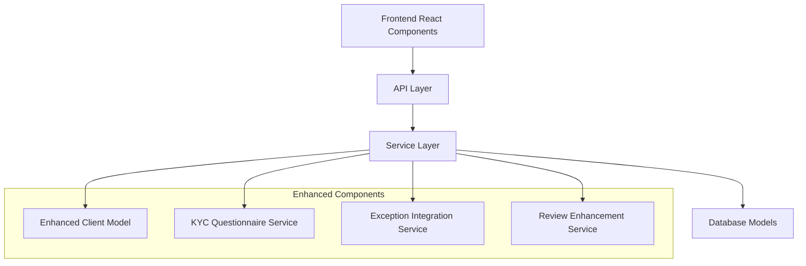
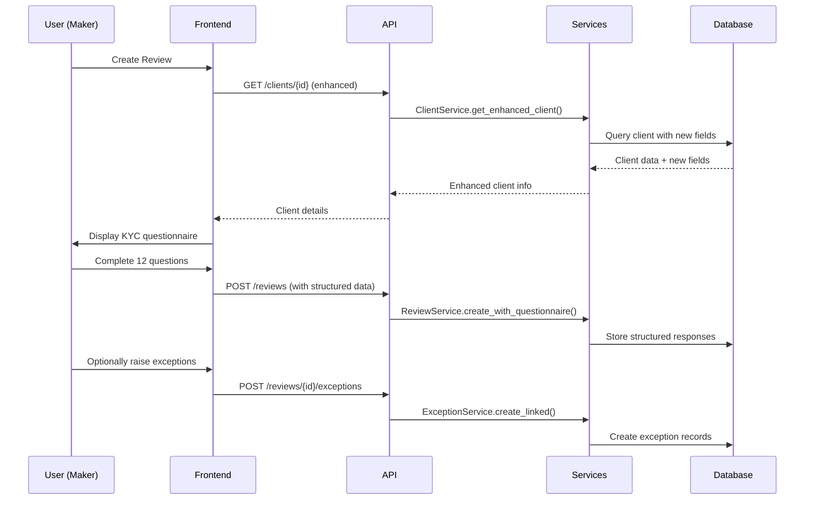

# Enhanced Client Review System Design

## Overview

This design extends the existing client review workflow system with enhanced client information management, structured KYC questionnaires, and integrated exception handling. The solution maintains backward compatibility while adding comprehensive compliance features.

## Architecture

### System Components



### Data Flow



## Components and Interfaces

### Enhanced Client Model

```python
class Client(BaseModel):
    # Existing fields...
    client_id: str
    name: str
    risk_level: RiskLevel
    country: str
    status: ClientStatus
    
    # New enhanced fields
    domicile_branch: Optional[str] = None
    relationship_manager: Optional[str] = None
    business_unit: Optional[str] = None
    aml_risk: Optional[AMLRiskLevel] = None
    
    # Metadata
    created_at: datetime
    updated_at: datetime

class AMLRiskLevel(enum.Enum):
    LOW = "low"
    MEDIUM = "medium"
    HIGH = "high"
    VERY_HIGH = "very_high"
```

### KYC Questionnaire Structure

```python
class KYCQuestionnaire(BaseModel):
    review_id: int
    
    # Question responses
    purpose_of_account: str  # Q1: Free text
    kyc_documents_complete: YesNoNA  # Q2: Dropdown
    missing_kyc_details: Optional[str]  # Q3: Free text (conditional)
    account_purpose_aligned: YesNoNA  # Q4: Dropdown
    adverse_media_completed: YesNoNA  # Q5: Dropdown
    adverse_media_evidence: Optional[str]  # Q5: Additional info
    senior_mgmt_approval: Optional[YesNo]  # Q6: Conditional dropdown
    pep_approval_obtained: YesNoNA  # Q7: Dropdown
    static_data_correct: YesNoNA  # Q8: Dropdown
    kyc_documents_valid: YesNoNA  # Q9: Dropdown
    regulated_business_license: YesNoNA  # Q10: Dropdown
    remedial_actions: Optional[str]  # Q11: Free text (conditional)
    source_of_funds_docs: List[int]  # Q12: Document IDs
    
    created_at: datetime
    updated_at: datetime

# Note: The existing document upload system remains fully functional
# Documents can be uploaded for:
# 1. General review supporting documents (existing functionality)
# 2. Specific KYC question evidence (Q5 adverse media screenshots)
# 3. Source of funds documentation (Q12)
# 4. Any additional compliance documentation

class YesNoNA(enum.Enum):
    YES = "yes"
    NO = "no"
    NOT_APPLICABLE = "not_applicable"

class YesNo(enum.Enum):
    YES = "yes"
    NO = "no"
```

### Exception Integration

```python
class ReviewException(BaseModel):
    review_id: int
    exception_type: ExceptionType
    description: str
    status: ExceptionStatus
    created_by: int
    resolved_by: Optional[int]
    resolution_notes: Optional[str]
    created_at: datetime
    resolved_at: Optional[datetime]

class ExceptionType(enum.Enum):
    KYC_NON_COMPLIANCE = "kyc_non_compliance"
    DORMANT_FUNDED_UFAA = "dormant_funded_ufaa"
    DORMANT_OVERDRAWN_EXIT = "dormant_overdrawn_exit"

class ExceptionStatus(enum.Enum):
    OPEN = "open"
    IN_PROGRESS = "in_progress"
    RESOLVED = "resolved"
    CLOSED = "closed"
```

## Data Models

### Database Schema Changes

#### Client Table Enhancement
```sql
ALTER TABLE clients ADD COLUMN domicile_branch VARCHAR(100);
ALTER TABLE clients ADD COLUMN relationship_manager VARCHAR(100);
ALTER TABLE clients ADD COLUMN business_unit VARCHAR(100);
ALTER TABLE clients ADD COLUMN aml_risk VARCHAR(20);
```

#### New KYC Questionnaire Table
```sql
CREATE TABLE kyc_questionnaires (
    id SERIAL PRIMARY KEY,
    review_id INTEGER REFERENCES reviews(id) ON DELETE CASCADE,
    purpose_of_account TEXT,
    kyc_documents_complete VARCHAR(20),
    missing_kyc_details TEXT,
    account_purpose_aligned VARCHAR(20),
    adverse_media_completed VARCHAR(20),
    adverse_media_evidence TEXT,
    senior_mgmt_approval VARCHAR(10),
    pep_approval_obtained VARCHAR(20),
    static_data_correct VARCHAR(20),
    kyc_documents_valid VARCHAR(20),
    regulated_business_license VARCHAR(20),
    remedial_actions TEXT,
    source_of_funds_docs JSONB,
    created_at TIMESTAMP DEFAULT CURRENT_TIMESTAMP,
    updated_at TIMESTAMP DEFAULT CURRENT_TIMESTAMP
);
```

#### Review Exceptions Table
```sql
CREATE TABLE review_exceptions (
    id SERIAL PRIMARY KEY,
    review_id INTEGER REFERENCES reviews(id) ON DELETE CASCADE,
    exception_type VARCHAR(50) NOT NULL,
    description TEXT,
    status VARCHAR(20) DEFAULT 'open',
    created_by INTEGER REFERENCES users(id),
    resolved_by INTEGER REFERENCES users(id),
    resolution_notes TEXT,
    created_at TIMESTAMP DEFAULT CURRENT_TIMESTAMP,
    resolved_at TIMESTAMP
);
```

## Error Handling

### Validation Rules

1. **Client Enhancement Validation**
   - AML risk level must be valid enum value
   - Business unit must be from predefined list
   - Relationship manager must be valid user

2. **KYC Questionnaire Validation**
   - Required questions must be answered
   - Conditional questions validated based on dependencies
   - Document references must exist and be accessible

3. **Exception Handling**
   - Exception types must be valid
   - Review must exist and be in appropriate status
   - User must have permission to raise exceptions

### Error Response Format
```json
{
  "error": "validation_failed",
  "message": "KYC questionnaire validation failed",
  "details": {
    "missing_kyc_details": "Required when kyc_documents_complete is 'no'",
    "source_of_funds_docs": "At least one document required for question 12"
  }
}
```

## Testing Strategy

### Unit Tests
- Client model validation with new fields
- KYC questionnaire service logic
- Exception creation and linking
- Review workflow with structured data

### Integration Tests
- End-to-end review creation with questionnaire
- Exception raising and resolution workflow
- Client data retrieval with enhancements
- Database migration validation

### API Tests
- Enhanced client endpoints
- KYC questionnaire CRUD operations
- Exception management endpoints
- Review submission with exceptions

### Frontend Tests
- KYC questionnaire form validation
- Client detail display with new fields
- Exception management UI components
- Review workflow integration

## Security Considerations

1. **Data Access Control**
   - Enhanced client data requires appropriate permissions
   - KYC responses contain sensitive information
   - Exception details may contain confidential data

2. **Audit Trail**
   - All questionnaire responses logged
   - Exception creation and resolution tracked
   - Client data changes audited

3. **Data Validation**
   - Input sanitization for all text fields
   - File upload validation for supporting documents
   - Enum validation for dropdown selections

## Performance Considerations

1. **Database Optimization**
   - Indexes on new client fields for filtering
   - Efficient joins for questionnaire data
   - Exception status queries optimization

2. **Caching Strategy**
   - Client enhancement data caching
   - Questionnaire template caching
   - Exception type definitions caching

3. **API Response Optimization**
   - Selective field loading for client lists
   - Pagination for exception histories
   - Compressed responses for large questionnaires