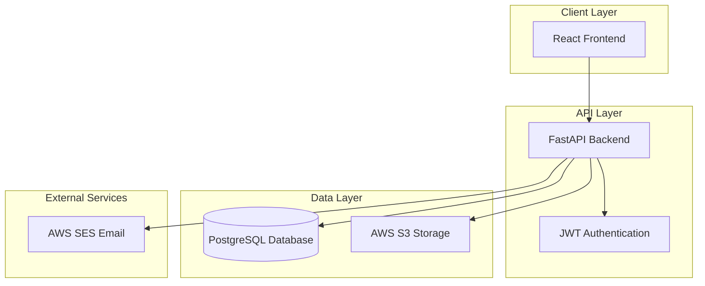
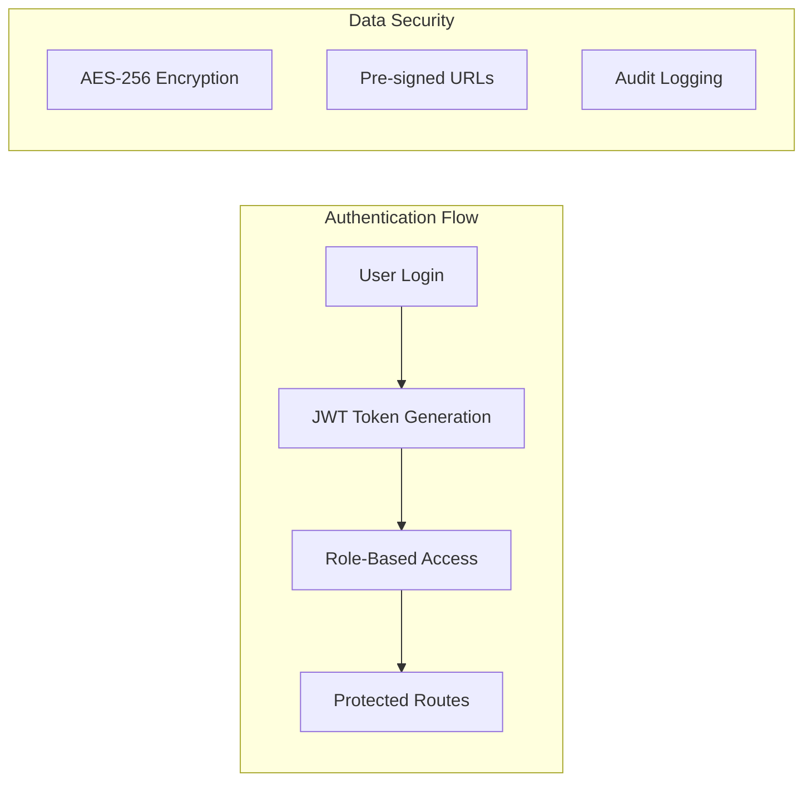
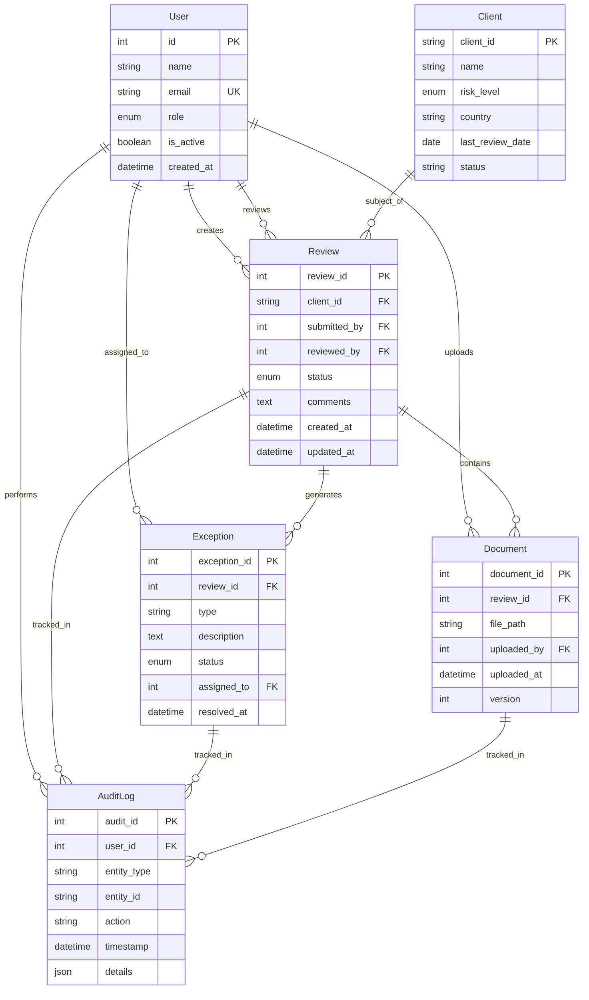
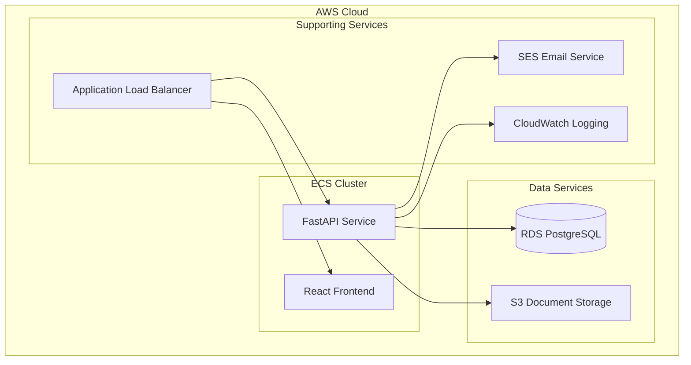

# Design Document

## Overview

The High Risk Client Review Workflow is a comprehensive web application built with a modern tech stack to ensure scalability, security, and maintainability. The system implements a maker-checker pattern for AML/CTF compliance reviews with robust audit trails and document management capabilities.

### Technology Stack
- **Frontend**: React with TypeScript for type safety and modern UI development
- **Backend**: FastAPI with Python for high-performance async API development
- **Database**: PostgreSQL for reliable ACID transactions and complex queries
- **ORM**: SQLAlchemy 2.0 for modern Python database interactions
- **Authentication**: JWT tokens with role-based access control
- **File Storage**: AWS S3 with pre-signed URLs for secure document handling
- **Email**: AWS SES for reliable notification delivery
- **Hosting**: AWS ECS for containerized deployment and scalability

## Architecture

### System Architecture



### Security Architecture



## Components and Interfaces

### Backend Components

#### 1. Authentication Service
- **Purpose**: Handle user authentication and JWT token management
- **Key Functions**:
  - User login with password hashing (bcrypt)
  - JWT token generation and validation
  - Role-based access control enforcement
- **Dependencies**: FastAPI Security, python-jose, passlib

#### 2. User Management Service
- **Purpose**: Manage user accounts and role assignments
- **Key Functions**:
  - User CRUD operations
  - Role assignment and validation
  - User activation/deactivation
- **Security**: Admin-only access for user management

#### 3. Client Management Service
- **Purpose**: Handle high-risk client data and filtering
- **Key Functions**:
  - Client data retrieval with filtering
  - Risk level management
  - Client status tracking
- **Performance**: Indexed queries for efficient filtering

#### 4. Review Workflow Service
- **Purpose**: Core business logic for review processes
- **Key Functions**:
  - Review creation and submission
  - Maker-checker workflow implementation
  - Status transitions and validations
- **Business Rules**: Enforce maker-checker separation

#### 5. Exception Management Service
- **Purpose**: Handle compliance exceptions and resolution tracking
- **Key Functions**:
  - Exception creation and assignment
  - Status tracking and resolution
  - Escalation workflows
- **Integration**: Links to review workflow and audit system

#### 6. Document Management Service
- **Purpose**: Secure document upload and retrieval
- **Key Functions**:
  - Generate pre-signed S3 URLs
  - Document metadata management
  - Version control and access logging
- **Security**: Pre-signed URLs with expiration

#### 7. Audit Service
- **Purpose**: Comprehensive activity logging for compliance
- **Key Functions**:
  - Automatic audit trail generation
  - Structured logging with JSON details
  - Query and export capabilities
- **Compliance**: Immutable audit records

#### 8. Notification Service
- **Purpose**: Email notifications for workflow events
- **Key Functions**:
  - Template-based email generation
  - Role-based recipient selection
  - Delivery tracking and retry logic
- **Integration**: AWS SES with bounce handling

### Frontend Components

#### 1. Authentication Components
- **LoginForm**: User authentication interface
- **ProtectedRoute**: Route wrapper for authenticated access
- **RoleGuard**: Component-level role-based access control

#### 2. Dashboard Components
- **DashboardSummary**: KPI metrics and charts
- **NotificationPanel**: Real-time notifications
- **QuickActions**: Common workflow shortcuts

#### 3. Client Management Components
- **ClientList**: Filterable table of high-risk clients
- **ClientFilter**: Advanced filtering interface
- **ClientDetails**: Detailed client information view

#### 4. Review Components
- **ReviewForm**: Create and edit review interface
- **ReviewList**: List of reviews with status indicators
- **CheckerPanel**: Review approval/rejection interface
- **DocumentUpload**: Secure file upload component

#### 5. Exception Components
- **ExceptionList**: Exception tracking interface
- **ExceptionForm**: Exception creation and resolution
- **ExceptionAssignment**: Assignment management

#### 6. Audit Components
- **AuditLogViewer**: Searchable audit trail
- **AuditExport**: Report generation interface
- **AuditFilters**: Advanced filtering options

#### 7. Admin Components
- **UserManagement**: User CRUD operations
- **RoleAssignment**: Role management interface
- **SystemSettings**: Configuration management

## Data Models

### Core Entity Relationships



### Database Schema Considerations

#### Indexing Strategy
- Primary keys: Clustered indexes for optimal performance
- Foreign keys: Non-clustered indexes for join operations
- Audit logs: Composite index on (timestamp, user_id, entity_type)
- Client filters: Indexes on risk_level, country, status

#### Data Integrity
- Foreign key constraints with CASCADE/RESTRICT rules
- Check constraints for enum values
- NOT NULL constraints for required fields
- Unique constraints for business keys

#### Performance Optimization
- Connection pooling for database connections
- Query optimization with EXPLAIN ANALYZE
- Pagination for large result sets
- Caching for frequently accessed data

## Error Handling

### API Error Response Format

```json
{
  "error": {
    "code": "VALIDATION_ERROR",
    "message": "Invalid input data",
    "details": {
      "field": "email",
      "reason": "Invalid email format"
    },
    "timestamp": "2024-01-15T10:30:00Z",
    "request_id": "req_123456"
  }
}
```

### Error Categories

#### 1. Authentication Errors (401)
- Invalid credentials
- Expired tokens
- Insufficient permissions

#### 2. Validation Errors (400)
- Invalid input format
- Missing required fields
- Business rule violations

#### 3. Authorization Errors (403)
- Role-based access denied
- Resource ownership violations
- Workflow state restrictions

#### 4. Not Found Errors (404)
- Resource not found
- Invalid entity references

#### 5. Conflict Errors (409)
- Duplicate submissions
- Concurrent modification conflicts
- Workflow state conflicts

#### 6. Server Errors (500)
- Database connection failures
- External service unavailability
- Unexpected system errors

### Frontend Error Handling

#### Error Boundary Implementation
- Global error boundary for unhandled exceptions
- Component-level error boundaries for isolated failures
- User-friendly error messages with recovery options

#### Retry Logic
- Automatic retry for transient failures
- Exponential backoff for API calls
- User-initiated retry options

## Testing Strategy

### Backend Testing

#### Unit Tests
- Service layer business logic testing
- Database model validation
- Authentication and authorization logic
- Utility function testing

#### Integration Tests
- API endpoint testing with test database
- Database transaction testing
- External service integration (mocked)
- End-to-end workflow testing

#### Security Tests
- Authentication bypass attempts
- Authorization boundary testing
- Input validation and SQL injection prevention
- JWT token manipulation testing

### Frontend Testing

#### Component Tests
- React component rendering
- User interaction simulation
- Props and state management
- Error boundary testing

#### Integration Tests
- API integration testing
- Route navigation testing
- Form submission workflows
- Authentication flow testing

#### End-to-End Tests
- Complete user workflows
- Cross-browser compatibility
- Performance testing
- Accessibility compliance

### Test Data Management

#### Test Database
- Isolated test database instance
- Automated test data seeding
- Transaction rollback for test isolation
- Realistic test data scenarios

#### Mock Services
- AWS S3 service mocking
- Email service mocking
- External API mocking
- Time-based testing utilities

### Continuous Integration

#### Automated Testing Pipeline
- Unit test execution on every commit
- Integration test execution on pull requests
- Security scan integration
- Code coverage reporting

#### Quality Gates
- Minimum code coverage thresholds
- Security vulnerability scanning
- Performance regression testing
- Accessibility compliance checking

## Deployment Architecture

### AWS ECS Deployment



### Security Considerations

#### Network Security
- VPC with private subnets for database
- Security groups with minimal required access
- SSL/TLS encryption for all communications
- WAF protection for web applications

#### Data Security
- Encryption at rest for RDS and S3
- Encryption in transit for all API calls
- Secure key management with AWS KMS
- Regular security audits and penetration testing

#### Access Control
- IAM roles with least privilege principle
- Service-to-service authentication
- API rate limiting and throttling
- Regular access review and rotation